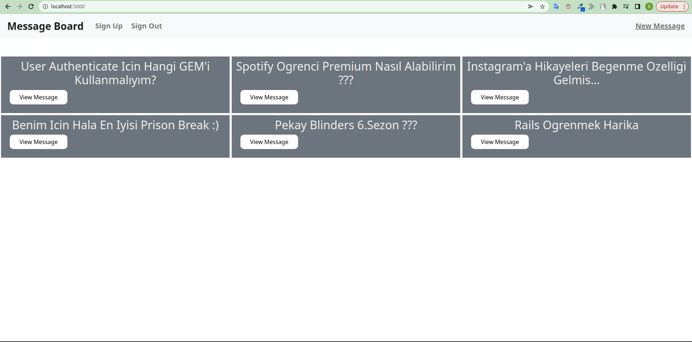
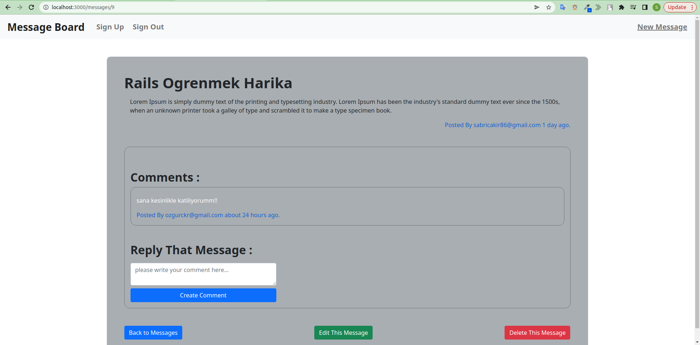
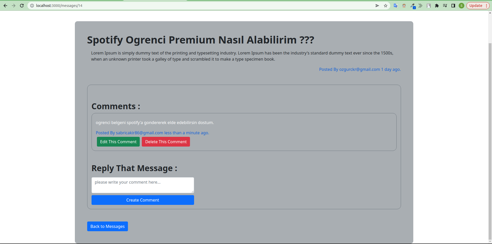
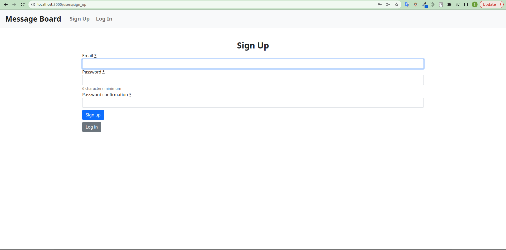
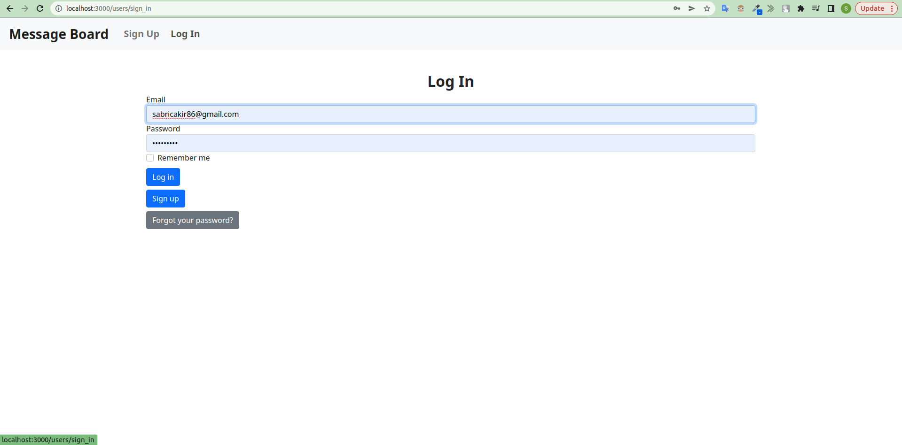

# Message Board APP with Rails 7

### Bu projemde Rails 7 ile Message Board Uygulaması Gerçekleştirdim.
➡ Bu Web Uygulamasında user authentication sistemi de mevcut (yeni bir kullanıcı olarak kayıt olup ya da var olan bir kullanıcı ile giriş yapabiliyorsunuz)
bkz. [devise-gem](https://rubygems.org/gems/devise)  
➡ Bir kullanıcı olarak giriş yapsanız da yapmasanız da bütün mesajları görebildiğiniz bir ana sayfa karşılıyor sizleri. 
➡ Bir kullanıcı olarak giriş yaptığınızda dilerseniz yeni bir mesaj oluşturabilir veya var olan bir mesaja yorum bırakabilirsiniz. 
➡ Yeni bir mesaj oluşturmak ya da bir mesaja yorum yapmak isterseniz giriş yapmak zorunlu tutulmuştur. 
➡ Her mesajın ve her yorumun altında o mesajı/yorumu kimin yaptığı ve ne zaman yaptığına dair bilgilendirme mesajları bulunmaktadır. 
➡ Son olarak bu Web Uygulamasının stil düzenlemesini ise [bootstrap 5](https://getbootstrap.com/) kullanarak gerçekleştirdim. 
 
 
 
  
  
  
   
   
  
  
  
   
   
  
  
  
   
   
  
  
  
   
   
  
  
